# Drive Duplicate Cleaner

Automatically clean duplicate files from Google Drive folders based on MD5 checksums. Designed to handle duplicate attachments that occur when multiple users receive the same email and their respective Flows save attachments simultaneously to shared Drive folders.

## Table of Contents

- [Drive Duplicate Cleaner](#drive-duplicate-cleaner)
  - [Table of Contents](#table-of-contents)
  - [Features](#features)
  - [How It Works](#how-it-works)
  - [Installation](#installation)
    - [Prerequisites](#prerequisites)
    - [Setup Steps](#setup-steps)
  - [Configuration](#configuration)
    - [Initial Setup](#initial-setup)
    - [Update Configuration](#update-configuration)
    - [Configuration Options](#configuration-options)
    - [Finding Folder IDs](#finding-folder-ids)
  - [Usage](#usage)
    - [Manual Execution](#manual-execution)
    - [Automated Execution (Recommended)](#automated-execution-recommended)
    - [Testing Before Live Run](#testing-before-live-run)
    - [Viewing Configuration](#viewing-configuration)
  - [How Duplicates Are Identified](#how-duplicates-are-identified)
  - [Folder Prioritization](#folder-prioritization)
    - [LAST\_UPDATED (Default)](#last_updated-default)
    - [RANDOM](#random)
  - [Exclusions](#exclusions)
    - [Folder Exclusions](#folder-exclusions)
    - [Extension Exclusions](#extension-exclusions)
    - [File Age Filter](#file-age-filter)
    - [Folder Merge](#folder-merge)
  - [Project Structure](#project-structure)
  - [Process Flow Diagram](#process-flow-diagram)
  - [Development](#development)
    - [Local Development](#local-development)
    - [Viewing Logs](#viewing-logs)
    - [Pull Changes from Apps Script](#pull-changes-from-apps-script)
  - [Troubleshooting](#troubleshooting)
    - ["Drive.Files.get is not a function" or "Drive is not defined"](#drivefilesget-is-not-a-function-or-drive-is-not-defined)
    - ["ROOT\_FOLDER\_IDS is empty"](#root_folder_ids-is-empty)
    - ["Cannot access folder X"](#cannot-access-folder-x)
    - [Script times out](#script-times-out)
    - [Too many duplicates deleted](#too-many-duplicates-deleted)
    - [Files not being detected as duplicates](#files-not-being-detected-as-duplicates)
  - [Limitations](#limitations)
  - [Safety Features](#safety-features)
  - [License](#license)

## Features

- **MD5-based Detection**: Uses cryptographic hashes to identify truly identical files
- **Smart Prioritization**: Processes recently modified folders first
- **Multiple Root Folders**: Support for multiple Drive folders and Shared Drives
- **Configurable Time Window**: Only delete duplicates created within a specific timeframe
- **Folder Exclusions**: Exclude sensitive folders (and their subfolders) by ID
- **Extension Filtering**: Optionally exclude specific file types
- **Dry-Run Mode**: Test without deleting anything
- **Safe Deletion**: Moves files to trash (recoverable for 30 days) instead of permanent deletion
- **Graceful Timeout Handling**: Stops cleanly before Apps Script execution limits

## How It Works

1. **Selection**: Sorts folders by last modification date (most recent first)
2. **Grouping**: Groups files by MD5 checksum (identical content = same MD5)
3. **Preservation**: Always keeps the oldest file in each group
4. **Deletion**: Removes duplicates created within the configured time window (default: 24 hours)
5. **Safety**: Moves duplicates to trash, not permanent deletion

## Installation

### Prerequisites

- Node.js and npm installed
- Google account with access to target Drive folders
- clasp CLI installed globally: `npm install -g @google/clasp`

### Setup Steps

1. **Clone or download this repository**

2. **Install dependencies**

   ```bash
   npm install
   ```

3. **Login to clasp**

   ```bash
   npm run login
   ```

4. **Create a new Apps Script project**

   ```bash
   npm run create
   ```

   This will create a new standalone Apps Script project and generate `.clasp.json`

5. **Compile TypeScript and push to Google**

   ```bash
   npm run push
   ```

6. **Open the Apps Script editor**

   ```bash
   npm run open
   ```

7. **Enable Google Drive API Service** (REQUIRED)

   - In the Apps Script editor, click on **Services** (+ icon) in the left sidebar
   - Find **"Google Drive API"**
   - Set:
     - **Version**: v3
     - **Identifier**: `Drive`
   - Click **Add**

   > ⚠️ **Important**: This step is required for the script to access MD5 checksums. Without it, you'll get errors like "Drive.Files.get is not a function".

8. **Grant Permissions** (First Run)

   When you run the script for the first time, Google will ask for permissions:

   

   You need to authorize:

   - ✅ **See, edit, create, and delete all of your Google Drive files** - Required to analyze files and move duplicates to trash
   - ⚠️ **Allow this application to run when you are not present** - Optional, only needed if you want automated triggers

## Configuration

### Initial Setup

1. In the Apps Script editor, run the `setupConfig` function once
2. This creates the configuration in Script Properties
3. Follow the instructions in the execution log to:
   - Enable Drive API Service (if not done already)
   - Configure your folder IDs
   - Set up Script Properties

### Update Configuration

Update configuration values using Script Properties:

```javascript
// Set your root folder ID(s)
PropertiesService.getScriptProperties().setProperty(
  "ROOT_FOLDER_IDS",
  JSON.stringify(["YOUR_FOLDER_ID_1", "YOUR_FOLDER_ID_2"])
);

// Set duplication window (hours)
PropertiesService.getScriptProperties().setProperty(
  "DUPLICATION_WINDOW_HOURS",
  "24"
);

// Set maximum execution time (seconds)
PropertiesService.getScriptProperties().setProperty(
  "MAX_EXECUTION_TIME_SECONDS",
  "300"
);

// Exclude specific folders by ID
PropertiesService.getScriptProperties().setProperty(
  "EXCLUDED_FOLDER_IDS",
  JSON.stringify(["FOLDER_ID_TO_EXCLUDE"])
);

// Exclude specific file extensions
PropertiesService.getScriptProperties().setProperty(
  "EXCLUDED_EXTENSIONS",
  JSON.stringify(["tmp", "log"])
);

// Set folder sort mode
PropertiesService.getScriptProperties().setProperty(
  "FOLDER_SORT_MODE",
  "LAST_UPDATED"
);

// Set file age filter (0 = all files, N = only files created in last N days)
PropertiesService.getScriptProperties().setProperty(
  "FILE_AGE_FILTER_DAYS",
  "0"
);

// Enable folder merge feature (default: false - disabled)
PropertiesService.getScriptProperties().setProperty(
  "MERGE_DUPLICATE_FOLDERS",
  "false"
);

// Merge folders recursively (default: true)
PropertiesService.getScriptProperties().setProperty(
  "MERGE_FOLDERS_RECURSIVE",
  "true"
);

// Strategy for selecting which folder to keep (OLDEST, NEWEST, or MOST_FILES)
PropertiesService.getScriptProperties().setProperty(
  "MERGE_KEEP_FOLDER_STRATEGY",
  "OLDEST"
);

// Enable/disable dry-run mode
PropertiesService.getScriptProperties().setProperty("DRY_RUN", "false");
```

### Configuration Options

| Option                       | Type     | Default        | Description                                                           |
| ---------------------------- | -------- | -------------- | --------------------------------------------------------------------- |
| `ROOT_FOLDER_IDS`            | string[] | `[]`           | Array of folder IDs to process (supports My Drive and Shared Drives)  |
| `DUPLICATION_WINDOW_HOURS`   | number   | `24`           | Only delete duplicates created within this many hours of the original |
| `MAX_EXECUTION_TIME_SECONDS` | number   | `300`          | Stop execution before this limit (Apps Script limit is 360 seconds)   |
| `EXCLUDED_FOLDER_IDS`        | string[] | `[]`           | Folders to skip (automatically excludes subfolders too)               |
| `EXCLUDED_EXTENSIONS`        | string[] | `[]`           | File extensions to skip (e.g., `['exe', 'dmg']`)                      |
| `FOLDER_SORT_MODE`           | string   | `LAST_UPDATED` | Folder processing order: `LAST_UPDATED` (recent first) or `RANDOM`    |
| `FILE_AGE_FILTER_DAYS`       | number   | `0`            | Only analyze files created in last N days (`0` = all files)           |
| `MERGE_DUPLICATE_FOLDERS`    | boolean  | `false`        | Enable automatic merging of folders with same name at same level      |
| `MERGE_FOLDERS_RECURSIVE`    | boolean  | `true`         | Merge duplicate subfolders recursively (if merge is enabled)          |
| `MERGE_KEEP_FOLDER_STRATEGY` | string   | `OLDEST`       | Which folder to keep: `OLDEST`, `NEWEST`, or `MOST_FILES`             |
| `DRY_RUN`                    | boolean  | `true`         | If `true`, no files are deleted (test mode)                           |

### Finding Folder IDs

1. Open the folder in Google Drive
2. The URL will be: `https://drive.google.com/drive/folders/FOLDER_ID_HERE`
3. Copy the `FOLDER_ID_HERE` part

## Usage

### Manual Execution

In the Apps Script editor, run the `cleanDuplicateAttachments` function.

### Automated Execution (Recommended)

1. In Apps Script editor, go to **Triggers** (clock icon on left sidebar)
2. Click **Add Trigger**
3. Configure:
   - Function: `cleanDuplicateAttachments`
   - Event source: **Time-driven**
   - Type: **Minutes timer**
   - Interval: **Every 10 minutes**

This ensures the script runs continuously, processing folders in order of recent activity.

### Testing Before Live Run

1. Keep `DRY_RUN=true` initially
2. Run `cleanDuplicateAttachments` manually
3. Check logs (View > Logs or Ctrl+Enter)
4. Verify the files it would delete are correct
5. Set `DRY_RUN=false` when ready

### Viewing Configuration

Run the `viewConfig` function to see current settings.

## How Duplicates Are Identified

1. **Files are grouped by MD5 checksum** - Only files with identical content are considered duplicates
2. **Within each group, files are sorted by creation date** (oldest first)
3. **The oldest file is always preserved**
4. **Newer files are only deleted if created within the duplication window** (e.g., within 24 hours of the oldest)

This ensures:

- ✅ No false positives (MD5 collision is virtually impossible)
- ✅ Original files are never deleted
- ✅ Old duplicates outside the window are preserved (may be intentional copies)

## Folder Prioritization

You can configure how folders are prioritized using `FOLDER_SORT_MODE`:

### LAST_UPDATED (Default)

Folders are sorted by **last modification date** before processing:

- ✅ Recently active folders are processed first (where duplicates are most likely)
- ✅ After initial cleanup, executions complete quickly (only a few active folders)
- ✅ All folders are eventually covered across multiple executions
- ✅ **Best for automated/scheduled runs** - naturally prioritizes active areas

### RANDOM

Folders are processed in **random order** each execution:

- ✅ Provides even distribution across all folders over time
- ✅ Useful for large folder structures with sporadic activity patterns
- ✅ Prevents any folder from being consistently skipped
- ✅ **Best for one-time cleanups** or when activity patterns are unpredictable

## Exclusions

### Folder Exclusions

- Specified by **Folder ID** (not name)
- **Automatically excludes all subfolders**
- Example: Exclude `/legal/` also excludes `/legal/contracts/2024/`

### Extension Exclusions

- Useful for policy reasons (e.g., never delete executables)
- Applied before MD5 check (performance optimization)

### File Age Filter

The `FILE_AGE_FILTER_DAYS` setting allows you to limit duplicate detection to recently created files:

- **`0` (default)**: Analyzes all files regardless of age
- **`N` (days)**: Only analyzes files created in the last N days

**When to use:**

- ✅ **Performance optimization**: Skip old files to speed up processing in large folders
- ✅ **Focus on recent duplicates**: Only clean up recent duplicate attachments
- ✅ **Incremental cleanup**: Process recent files first, older files later
- ✅ **Reduce API calls**: Fewer files analyzed = fewer Drive API calls = faster execution

**Example use cases:**

- Set to `7` to only clean duplicates from the last week
- Set to `30` to focus on files from the last month
- Set to `1` for daily cleanup of same-day duplicates

**Note:** This filter is applied before MD5 calculation, so it improves performance by skipping file analysis entirely for old files.

### Folder Merge

The `MERGE_DUPLICATE_FOLDERS` feature automatically detects and merges folders with identical names at the same hierarchy level.

**Common Scenario:**

Automated processes (email-to-Drive flows, Zapier, Make, etc.) create duplicate folders when they can't find an existing one:

```text
Before:
📁 Shared Drive/
  📁 dcycle.io (created by automation on Nov 14)
    📄 contract-v1.pdf
  📁 dcycle.io (created by automation on Nov 17)
    📄 contract-v2.pdf
    📄 invoice.pdf
  📁 costa.io
    ...

After merge:
📁 Shared Drive/
  📁 dcycle.io (consolidated)
    📄 contract-v1.pdf
    📄 contract-v2.pdf
    📄 invoice.pdf
  📁 costa.io
    ...
```

**How it works:**

1. **Detection**: Scans all folders recursively, groups by `(parentId + name)`
2. **Selection**: Chooses one folder to keep based on `MERGE_KEEP_FOLDER_STRATEGY`:
   - `OLDEST`: Keep the first created folder (default)
   - `NEWEST`: Keep the most recently modified folder
   - `MOST_FILES`: Keep the folder with most files (recursive count)
3. **File merging**: Moves files from duplicate folders to the target
4. **Conflict resolution**: When files have same name:
   - **Same MD5**: Applies duplication window logic (like file cleanup)
   - **Different MD5**: Renames incoming file (e.g., `file.pdf` → `file (2).pdf`)
   - **No MD5**: Renames incoming file
5. **Cleanup**: Deletes empty source folders after merge

**Configuration:**

- `MERGE_DUPLICATE_FOLDERS`: `false` (default - feature disabled for safety)
- `MERGE_FOLDERS_RECURSIVE`: `true` (also merge duplicate subfolders)
- `MERGE_KEEP_FOLDER_STRATEGY`: `'OLDEST'` (or `'NEWEST'` or `'MOST_FILES'`)

**When to enable:**

✅ **Enable if:**

- Automated processes create duplicate folders regularly
- You need to consolidate scattered content
- Your team creates duplicate folders manually

❌ **Keep disabled if:**

- Folder structure is well-maintained manually
- Duplicate folders serve different purposes (different contexts)
- You prefer manual review before merging

**Important notes:**

- ⚠️ **Test with DRY_RUN first**: Always run in dry-run mode to preview changes
- ⚠️ **Runs before file cleanup**: Folders are merged first, then files are cleaned
- ⚠️ **Recursive by default**: If two "Q1/" folders exist inside two "2024/" folders, all will be merged
- ⚠️ **Respects exclusions**: `EXCLUDED_FOLDER_IDS` are not scanned or merged

## Project Structure

```text
drive-delete-duplicated-files/
├── src/
│   ├── main.ts           # Entry points (cleanDuplicateAttachments, setupConfig)
│   ├── config.ts         # Configuration management
│   ├── processors.ts     # Core file processing logic
│   ├── folder-merger.ts  # Folder merge detection and execution
│   └── utils.ts          # Helper functions
├── appsscript.json       # Apps Script manifest
├── package.json          # Node dependencies and scripts
├── tsconfig.json         # TypeScript configuration
└── README.md             # This file
```

## Process Flow Diagram

This diagram illustrates the complete execution flow of the Drive Duplicate Cleaner, including both folder merge and file cleanup phases:

```mermaid
flowchart TD
    Start([Start Execution]) --> CheckMerge{MERGE_DUPLICATE_FOLDERS<br/>enabled?}

    %% Folder Merge Branch
    CheckMerge -->|Yes| ScanFolders[Scan all folders recursively<br/>using BFS]
    ScanFolders --> GroupFolders[Group folders by<br/>parentId + name]
    GroupFolders --> HasDuplicates{Found duplicate<br/>folder groups?}
    HasDuplicates -->|Yes| SelectTarget[Select target folder<br/>OLDEST/NEWEST/MOST_FILES]
    SelectTarget --> MoveFiles[Move files from duplicates<br/>to target folder]
    MoveFiles --> FileConflict{File name<br/>conflict?}
    FileConflict -->|No| MoveFile[Move file directly]
    FileConflict -->|Yes| CheckMD5{Same MD5?}
    CheckMD5 -->|Yes| CheckWindow{Within duplication<br/>window?}
    CheckWindow -->|Yes| DeleteDup[Delete duplicate file]
    CheckWindow -->|No| RenameFile[Rename incoming file<br/>e.g., file_2.pdf]
    CheckMD5 -->|No MD5 or Different| RenameFile
    MoveFile --> CheckEmpty{Source folder<br/>empty?}
    RenameFile --> CheckEmpty
    DeleteDup --> CheckEmpty
    CheckEmpty -->|Yes| DeleteFolder[Delete empty folder]
    CheckEmpty -->|No| KeepFolder[Keep folder]
    DeleteFolder --> NextFolder{More duplicate<br/>folders?}
    KeepFolder --> NextFolder
    NextFolder -->|Yes| SelectTarget
    NextFolder -->|No| FilesPhase
    HasDuplicates -->|No| FilesPhase
    CheckMerge -->|No| FilesPhase

    %% File Cleanup Branch
    FilesPhase[Phase 2: File Cleanup]
    FilesPhase --> SortFolders[Sort folders by mode<br/>LAST_UPDATED/RANDOM]
    SortFolders --> ProcessFolder[Process next folder]
    ProcessFolder --> GetFiles[Get all files in folder]
    GetFiles --> CheckFile{For each file}
    CheckFile --> IsTrashed{Trashed?}
    IsTrashed -->|Yes| NextFile
    IsTrashed -->|No| CheckAge{FILE_AGE_FILTER_DAYS<br/>enabled?}
    CheckAge -->|Yes| TooOld{File too old?}
    TooOld -->|Yes| SkipFile[Skip file]
    TooOld -->|No| CheckExt
    CheckAge -->|No| CheckExt{Extension<br/>excluded?}
    CheckExt -->|Yes| SkipFile
    CheckExt -->|No| GetMD5[Get MD5 checksum<br/>via Drive API]
    GetMD5 --> HasMD5{Has MD5?}
    HasMD5 -->|No| SkipFile
    HasMD5 -->|Yes| GroupByMD5[Add to MD5 group]
    SkipFile --> NextFile
    GroupByMD5 --> NextFile{More files?}
    NextFile -->|Yes| CheckFile
    NextFile -->|No| ProcessGroups[Process duplicate groups]
    ProcessGroups --> CheckDups{Group has<br/>duplicates?}
    CheckDups -->|Yes, 2+| SortByDate[Sort by creation date<br/>oldest first]
    SortByDate --> KeepOldest[Keep oldest file]
    KeepOldest --> CheckDupWindow{Duplicate within<br/>time window?}
    CheckDupWindow -->|Yes| TrashDup[Move to trash]
    CheckDupWindow -->|No| KeepDup[Keep both files]
    TrashDup --> NextGroup{More groups?}
    KeepDup --> NextGroup
    CheckDups -->|No, only 1| NextGroup
    NextGroup -->|Yes| CheckDups
    NextGroup -->|No| CheckTimeout{Timeout or<br/>more folders?}
    CheckTimeout -->|More folders| ProcessFolder
    CheckTimeout -->|Timeout/Done| Summary[Show summary statistics]
    Summary --> End([End Execution])

    style Start fill:#e1f5e1
    style End fill:#ffe1e1
    style CheckMerge fill:#fff4e1
    style FileConflict fill:#fff4e1
    style CheckMD5 fill:#e1f0ff
    style CheckWindow fill:#e1f0ff
    style CheckAge fill:#fff4e1
    style CheckExt fill:#fff4e1
    style HasMD5 fill:#e1f0ff
    style CheckDups fill:#fff4e1
    style CheckDupWindow fill:#e1f0ff
    style DeleteDup fill:#ffe1e1
    style TrashDup fill:#ffe1e1
    style DeleteFolder fill:#ffe1e1
```



**Key Decision Points:**

1. **Folder Merge (if enabled)**:

   - Groups folders with same name at same level
   - Resolves file conflicts using MD5 + duplication window
   - Deletes empty source folders after merge

2. **File Cleanup**:
   - Filters by age and extension before processing
   - Groups identical files by MD5 checksum
   - Only deletes duplicates within time window
   - Always preserves the oldest file

## Development

### Local Development

1. Make changes to TypeScript files in `src/`
2. Push changes: `npm run push`
3. Test in Apps Script editor

### Viewing Logs

```bash
npm run logs
```

Or in Apps Script editor: **View > Logs** (Ctrl+Enter)

### Pull Changes from Apps Script

If you make changes in the web editor:

```bash
npm run pull
```

## Troubleshooting

### "Drive.Files.get is not a function" or "Drive is not defined"

**Cause**: Google Drive API Service is not enabled.

**Solution**:

1. Open the Apps Script editor (`npm run open`)
2. Click **Services** (+ icon) in the left sidebar
3. Find **"Drive API"**
4. Version: **v3**, Identifier: **Drive**
5. Click **Add**

### "ROOT_FOLDER_IDS is empty"

Run `setupConfig()` first, then update the folder IDs in Project Settings > Script Properties.

### "Cannot access folder X"

- Verify the folder ID is correct
- Ensure the script has permission to access the folder
- For Shared Drives, ensure you have access
- Check that the folder hasn't been deleted or moved

### Script times out

- Reduce `MAX_EXECUTION_TIME_SECONDS` to stop earlier
- The script will resume on the next trigger execution
- With 10-minute triggers, all folders will be covered eventually

### Too many duplicates deleted

- Increase `DUPLICATION_WINDOW_HOURS` to be more conservative
- Use `DRY_RUN=true` to test first

### Files not being detected as duplicates

- Check if files have MD5 checksums (Google Docs native formats don't)
- Verify files are truly identical (same content byte-for-byte)

## Limitations

- **Apps Script execution limit**: 6 minutes per execution (script stops at 5 minutes by default)
- **Google Docs native formats**: Files without MD5 checksums are skipped (Docs, Sheets, Slides)
- **Trash retention**: Files in trash are auto-deleted after 30 days

## Safety Features

- ✅ **Dry-run mode** for testing
- ✅ **Trash instead of permanent deletion** (30-day recovery window)
- ✅ **Always preserves oldest file** in each group
- ✅ **Time window filter** prevents deleting old intentional copies
- ✅ **Graceful timeout handling** prevents incomplete operations

## License

MIT
